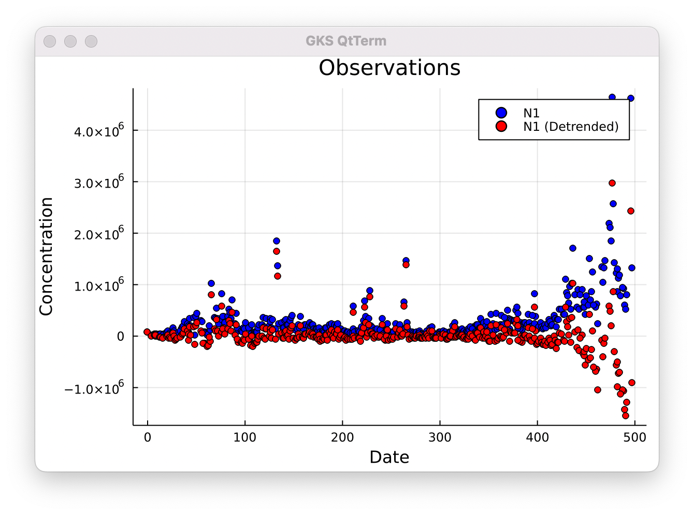

Step01 - Importing Data
=======================

This example displays Covid Wastewater data concentration as a function of time.

Directions:
-----------
To run from the command line, type:
```sh
julia step01.jl
```
To run as a notebook, type:
```sh
jupyter notebook step01.ipynb
```

Please allow several seconds for the Julia interepreter to load required modules and run.  If running from the command line, you should see the output displayed in a new window.  If running from a notebook, you should see the output displayed inside of the notebook.

Output:
-------
