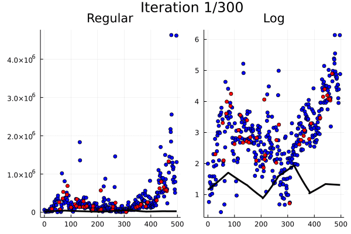

Step04 - Linear Log Spline
==========================

This example fits a segmented linear spline to the logarithms of the y values of the data.

Directions:
-----------
To run from the command line, type:
```sh
julia step04.jl
```
To run as a notebook, type:
```sh
jupyter notebook step04.ipynb
```

Please allow several seconds for the Julia interepreter to load required modules and run.  If running from the command line, you should see the output displayed in a new window.  If running from a notebook, you should see the output displayed inside of the notebook.

Output:
-------

